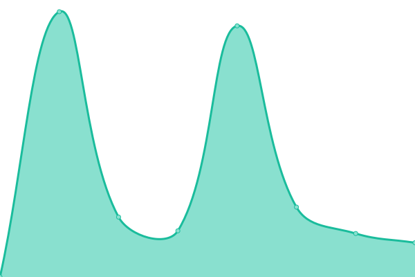

# [📈 Live Status](https://status.voit.cloud): <!--live status--> **Alt er fint!**

This repository contains the open-source uptime monitor and status page for [Upptime](https://upptime.js.org), powered by [Upptime](https://github.com/upptime/upptime).

With [Upptime](https://upptime.js.org), you can get your own unlimited and free uptime monitor and status page, powered entirely by a GitHub repository. We use [Issues](https://github.com/upptime/upptime/issues) as incident reports, [Actions](https://github.com/voitvode/upptime/actions) as uptime monitors, and [Pages](https://status.voit.cloud) for the status page.

<!--start: status pages-->
<!-- This summary is generated by Upptime (https://github.com/upptime/upptime) -->
<!-- Do not edit this manually, your changes will be overwritten -->
<!-- prettier-ignore -->
| URL | Status | History | Response Time | Uptime |
| --- | ------ | ------- | ------------- | ------ |
|  [Nextcloud fra Voit](https://voit.cloud) | 🟩 Up | [nextcloud-fra-voit.yml](https://github.com/voitcode/upptime/commits/HEAD/history/nextcloud-fra-voit.yml) | 

 1112ms
     
 | 

<a href="https://status.voit.cloud/history/nextcloud-fra-voit">100.00%</a>
    

|  [Wordpress fra Voit](https://voit.no/wp-login.php) | 🟩 Up | [wordpress-fra-voit.yml](https://github.com/voitcode/upptime/commits/HEAD/history/wordpress-fra-voit.yml) | 

 2199ms
     
 | 

<a href="https://status.voit.cloud/history/wordpress-fra-voit">100.00%</a>
    

|  [Prat med Voit](https://prat.voit.no) | 🟩 Up | [prat-med-voit.yml](https://github.com/voitcode/upptime/commits/HEAD/history/prat-med-voit.yml) | 

 1359ms
     
 | 

<a href="https://status.voit.cloud/history/prat-med-voit">100.00%</a>
    

|  [Gitea](https://git.voit.no) | 🟩 Up | [gitea.yml](https://github.com/voitcode/upptime/commits/HEAD/history/gitea.yml) | 

 1474ms
     
 | 

<a href="https://status.voit.cloud/history/gitea">99.42%</a>
    

|  [kuraas.no](https://kuraas.no/wp-login.php) | 🟩 Up | [kuraas-no.yml](https://github.com/voitcode/upptime/commits/HEAD/history/kuraas-no.yml) | 

 798ms
     
 | 

<a href="https://status.voit.cloud/history/kuraas-no">100.00%</a>
    

|  [Kuraas nettbutikk](https://kuraas.net) | 🟩 Up | [kuraas-nettbutikk.yml](https://github.com/voitcode/upptime/commits/HEAD/history/kuraas-nettbutikk.yml) | 

 2870ms
     
 | 

<a href="https://status.voit.cloud/history/kuraas-nettbutikk">100.00%</a>
    

<!--end: status pages-->

[**Visit our status website →**](https://status.voit.cloud)

## 📄 License

- Powered by: [Upptime](https://github.com/upptime/upptime)
- Code: [MIT](./LICENSE) © [Upptime](https://upptime.js.org)
- Data in the `./history` directory: [Open Database License](https://opendatacommons.org/licenses/odbl/1-0/)
